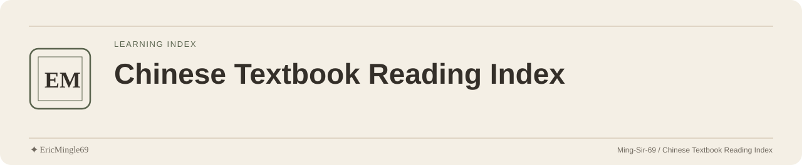

<picture>
  <source media="(prefers-color-scheme: dark)" srcset="readme-assets/header-dark.svg">
  <source media="(prefers-color-scheme: light)" srcset="readme-assets/header-light.svg">
  
</picture>

  <a href="README.md">简体中文</a> · <a href="README.en.md">English</a> · <a href="PERSONAL-NOTICE.md">✦ EricMingle69</a>

# 初高中语文课文目录

按年级、册次与单元整理的语文篇目索引，供学生、家长和学习资料整理者快速查找。
目录保留 376 条课文记录及作者，不包含诗文全文、题库或自动讲解程序。

## 打开完整目录

从[初高中目录.md](初高中目录.md)进入，使用 GitHub 文档目录或浏览器查找定位篇名与作者。
不用安装依赖，也不需要启动服务。

## 按学习阶段阅读

| 阶段 | 目录范围 |
| --- | --- |
| 初中 | 七年级、八年级、九年级上下册 |
| 高中必修 | 必修上册、必修下册 |
| 高中选择性必修 | 上册、中册、下册 |

目录按单元继续细分，同时保留整本书阅读和活动单元的记录。
查找同一作品时请结合册次与单元，而非仅凭作品名判断教学范围。

## 如何看待考点标注

“重点考点 / 考点 / 非考点”属于既有整理标注。
教材版本、地区和考试依据没有完整注明，应对照自己的教材与老师要求使用。
标注不代表当前官方考试标准，不能代替具体学习任务。

## 纠错与补充

建议提供篇名、作者、册次、单元和教材版本，并附可核对的出处。
目录结构或标注变动应说明对应版本，避免把不同教材体系混在一起。

## 来源与许可

所列作品与作者保留原有归属，目录维护不取得文学作品版权。
当前没有覆盖原目录的 LICENSE；复用整理内容与作品时需分别确认适用权限。

---

文档维护：**✦ EricMingle69** · [Ming-Sir-69](https://github.com/Ming-Sir-69)  
[个人标识、许可与权限说明](PERSONAL-NOTICE.md) · 明暗页眉随 GitHub 主题自动切换。
